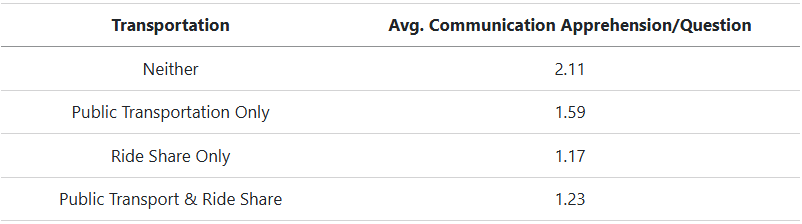

::: {style="display: flex; justify-content: center; align-items: baseline; gap: 6rem; padding-bottom: 0.8rem; margin-bottom: 1.2rem; border-bottom: 1px solid #dee2e6;"}

::: {}
**Researcher:** Tyler Johnston
:::

::: {}
**Date:** July 27, 2026
:::

:::

[**Research Question:**]{style="font-size: 1.25rem; display: block; text-align: center;"}

> ***Do ride-share and public transportation users differ in communication apprehension?***

**Yes.**

There was a consistent trend in which people who use ride share or public transportation (or both) had significantly lower communication apprehension than those who use neither, and that trend continued as frequency of use increased.

Ride-share-only users had lower communication apprehension on average than public-transportation-only users and even those who use both modes of transportation (@tbl-1).

{#tbl-1}

When looking at frequency of use, ride-share frequency was a significant negative predictor of communication apprehension, whereas public transportation frequency was not. @fig-1 helps visualize this pattern: the black line shows the overall negative relationship between transportation-use frequency and communication apprehension, while the other lines show the trends among ride-share-only and public-transportation-only users. The ride-share group shows a more pronounced decrease in communication apprehension as frequency increases, while the trend among public-transportation-only users is weaker.

{#fig-1}

## Remaining Questions

While ride-share frequency was a significant negative predictor of communication apprehension (*b* = −0.23, *p* < .001), whereas public transportation frequency was not (*b* = −0.05, *p* = .318), the difference between these two relationships has not yet been directly tested for statistical significance.