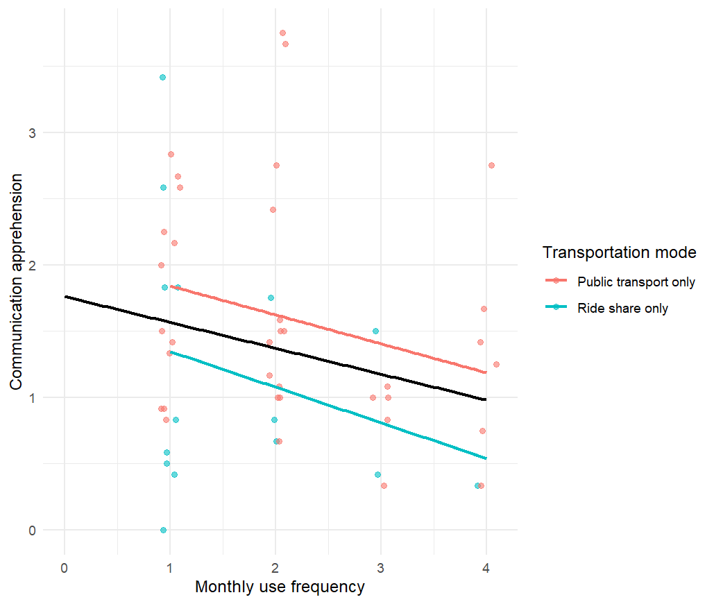

```{r echo=FALSE, include=FALSE}
library(tidyverse)
options(conflicts.policy = "depends.ok")
path_data <- "C:/Users/ttdog/Projects/groupproject_sibling_data/cleandata"
```
```{r echo=FALSE, include=FALSE}
data <- read.csv(here::here(path_data, "minimal_clean.csv")) |> 
  glimpse()
```
```{r echo=FALSE, include=FALSE}
data_all <- data |>
  mutate(
    Age = as.integer(Age),
    Sex = factor(Sex),
    public_transport = factor(
      public_transport,
      levels = c(0, 1)
    ),
    public_transport_monthly = ordered(
      public_transport_monthly,
      levels = c(0, 1, 2, 3, 4)
    ),
    public_transport_daily = ordered(
      public_transport_daily,
      levels = c(1, 2, 3, 4)
    ),
    ride_share = factor(
      ride_share,
      levels = c(0, 1)
    ),
    ride_share_monthly = ordered(
      ride_share_monthly,
      levels = c(0, 1, 2, 3, 4)
    ),
    ride_share_daily = ordered(
      ride_share_daily,
      levels = c(1, 2, 3, 4)
    )
  ) |>
  glimpse()
```
```{r echo=FALSE, include=FALSE}
data_all <- data_all |>
  mutate(
    transport_group = case_when(
      ride_share == 0 & public_transport == 0 ~ "Neither",
      ride_share == 1 & public_transport == 0 ~ "Ride share only",
      ride_share == 0 & public_transport == 1 ~ "Public transport only",
      ride_share == 1 & public_transport == 1 ~ "Both"
    ),
    transport_group = factor(
      transport_group,
      levels = c(
        "Neither",
        "Ride share only",
        "Public transport only",
        "Both"
      )
    )
  )
```
```{r echo=FALSE, include=FALSE}
ride_share_model <- lm(
  communication_apprehension ~ ride_share,
  data = data_all
)

summary(ride_share_model)
```
```{r echo=FALSE, include=FALSE}
public_transport_model <- lm(
  communication_apprehension ~ public_transport,
  data = data_all
)

summary(public_transport_model)
```

```{r echo=FALSE, include=FALSE}
transport_model <- lm(
  communication_apprehension ~ ride_share + public_transport,
  data = data_all
)

summary(transport_model)
```

```{r echo=FALSE, include=FALSE}
transport_group_model <- lm(
  communication_apprehension ~ transport_group,
  data = data_all
)

summary(transport_group_model)
```

```{r echo=FALSE, include=FALSE}
data_all <- data_all |>
  mutate(
    transport_group = relevel(
      transport_group,
      ref = "Public transport only"
    )
  )

model_group <- lm(
  communication_apprehension ~ transport_group,
  data = data_all
)

summary(model_group)
```
```{r echo=FALSE, include=FALSE}
data_all <- data_all |>
  mutate(
    any_transport = case_when(
      ride_share == 0 & public_transport == 0 ~ "Neither",
      ride_share == 1 | public_transport == 1 ~ "Any"
    ),
    any_transport = factor(
      any_transport,
      levels = c("Neither", "Any")
    )
  )

model_any <- lm(
  communication_apprehension ~ any_transport,
  data = data_all
)

summary(model_any)
```
```{r echo=FALSE, include=FALSE}
data_all |>
  group_by(ride_share_monthly) |>
  summarize(
    n = n(),
    mean_CA = mean(communication_apprehension, na.rm = TRUE),
    sd_CA = sd(communication_apprehension, na.rm = TRUE)
  )


data_all |>
  group_by(public_transport_monthly) |>
  summarize(
    n = n(),
    mean_CA = mean(communication_apprehension, na.rm = TRUE),
    sd_CA = sd(communication_apprehension, na.rm = TRUE)
  )
```
```{r echo=FALSE, include=FALSE}
model_ride_frequency <- lm(
  communication_apprehension ~ factor(ride_share_monthly),
  data = data_all
)

model_public_frequency <- lm(
  communication_apprehension ~ factor(public_transport_monthly),
  data = data_all
)

summary(model_ride_frequency)
summary(model_public_frequency)

anova(model_ride_frequency)
anova(model_public_frequency)
```
```{r echo=FALSE, include=FALSE}
model_frequency_both <- lm(
  communication_apprehension ~
    factor(ride_share_monthly) +
    factor(public_transport_monthly),
  data = data_all
)

summary(model_frequency_both)
anova(model_frequency_both)
```
```{r echo=FALSE, include=FALSE}
data_all <- data_all |>
  mutate(
    ride_frequency = as.numeric(as.character(ride_share_monthly)),
    public_frequency = as.numeric(as.character(public_transport_monthly))
  )

model_frequency <- lm(
  communication_apprehension ~ ride_frequency + public_frequency,
  data = data_all
)

summary(model_frequency)
```
```{r echo=FALSE, include=FALSE}
plot_data <- data_all |>
  select(
    communication_apprehension,
    ride_share_monthly,
    public_transport_monthly
  ) |>
  pivot_longer(
    cols = c(ride_share_monthly, public_transport_monthly),
    names_to = "transport",
    values_to = "frequency"
  ) |>
  mutate(
    frequency = as.numeric(as.character(frequency))
  )

ggplot(
  plot_data,
  aes(
    x = frequency,
    y = communication_apprehension,
    color = transport
  )
) +
  geom_jitter(width = 0.1, height = 0, alpha = 0.5) +
  geom_smooth(method = "lm", se = FALSE) +
  labs(
    x = "Monthly use frequency",
    y = "Communication apprehension",
    color = "Transportation mode"
  ) +
  theme_minimal()
```
```{r echo=FALSE, include=FALSE}
exclusive_plot <- data_all |>
  filter(
    transport_group %in% c(
      "Ride share only",
      "Public transport only"
    )
  ) |>
  mutate(
    frequency = if_else(
      transport_group == "Ride share only",
      as.numeric(as.character(ride_share_monthly)),
      as.numeric(as.character(public_transport_monthly))
    )
  )

ggplot(
  exclusive_plot,
  aes(
    x = frequency,
    y = communication_apprehension,
    color = transport_group
  )
) +
  geom_jitter(width = 0.1, height = 0, alpha = 0.6) +
  geom_smooth(method = "lm", se = FALSE) +
  labs(
    x = "Monthly use frequency",
    y = "Communication apprehension",
    color = "Transportation mode"
  ) +
  theme_minimal()
```
```{r echo=FALSE, include=FALSE}
exclusive_plot <- data_all |>
  filter(
    transport_group %in% c(
      "Ride share only",
      "Public transport only"
    )
  ) |>
  mutate(
    frequency = if_else(
      transport_group == "Ride share only",
      ride_frequency,
      public_frequency
    )
  )

all_plot <- data_all |>
  select(
    communication_apprehension,
    ride_frequency,
    public_frequency
  ) |>
  pivot_longer(
    cols = c(ride_frequency, public_frequency),
    values_to = "frequency"
  )

ggplot(
  exclusive_plot,
  aes(
    x = frequency,
    y = communication_apprehension,
    color = transport_group
  )
) +
  geom_jitter(
    width = 0.1,
    height = 0,
    alpha = 0.6
  ) +
  geom_smooth(
    method = "lm",
    se = FALSE
  ) +
  geom_smooth(
    data = all_plot,
    aes(
      x = frequency,
      y = communication_apprehension
    ),
    inherit.aes = FALSE,
    method = "lm",
    se = FALSE,
    color = "black"
  ) +
  labs(
    x = "Monthly use frequency",
    y = "Communication apprehension",
    color = "Transportation mode"
  ) +
  theme_minimal()
```

<style>
.quarto-title h1 {
  text-align: center;
  margin-bottom: 1rem;
}
</style>

::: {style="display: flex; justify-content: center; align-items: baseline; gap: 6rem; padding-bottom: 0.8rem; margin-bottom: 1.2rem; border-bottom: 1px solid #dee2e6;"}

::: {}
**Researcher:** Tyler Johnston
:::

::: {}
**Date:** July 27, 2026
:::

:::


[**Research Question:**]{style="font-size: 1.25rem; display: block; text-align: center;"}

> ***Do ride-share and public transportation users differ in communication apprehension?***

**Yes.**

There was a consistent trend in which people who use ride share or public transportation (or both) had significantly lower communication apprehension than those who use neither, and that trend continued as frequency of use increased.

Ride-share-only users had lower communication apprehension on average than public-transportation-only users and even those who use both modes of transportation (@tbl-1).

```{r}
#| label: tbl-1
#| tbl-cap: "Average communication apprehension by transportation group"
#| echo: false

data_all %>%
  group_by(transport_group) %>%
  summarise(
    mean_communication_apprehension = mean(
      communication_apprehension,
      na.rm = TRUE
    ),
    n_participants = n()
  ) %>%
  knitr::kable(
    col.names = c(
      "Transportation group",
      "Mean communication apprehension per Question",
      "N"
    ),
    digits = 2
  )
```
When looking at frequency of use, ride-share frequency was a significant negative predictor of communication apprehension (*b* = −0.23, *p* < .001), whereas public transportation frequency was not (*b* = −0.05, *p* = .318).
```{r}
model_frequency <- lm(
  communication_apprehension ~ ride_frequency + public_frequency,
  data = data_all)

summary(model_frequency)
```
 @fig-1 helps visualize this pattern: the black line shows the overall negative relationship between transportation-use frequency and communication apprehension, while the other lines show the trends among ride-share-only and public-transportation-only users. The ride-share group shows a more pronounced decrease in communication apprehension as frequency increases, while the trend among public-transportation-only users is weaker.

{#fig-1}


